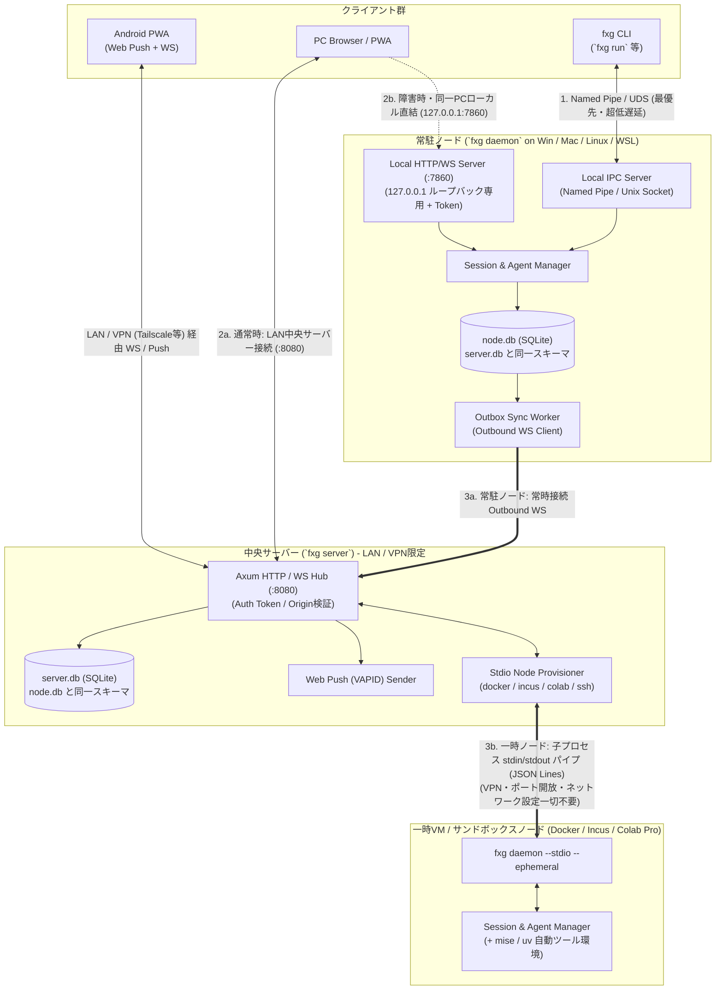
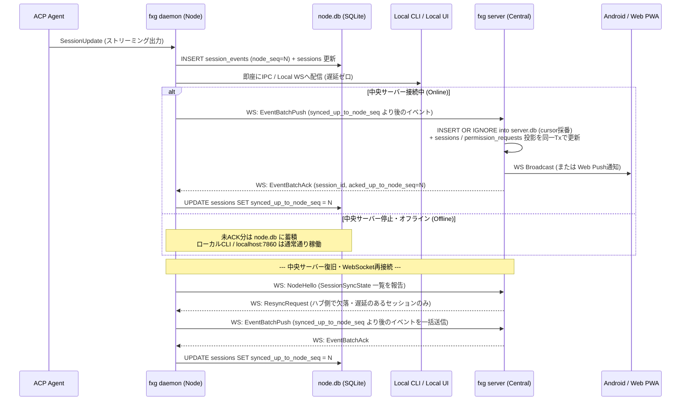
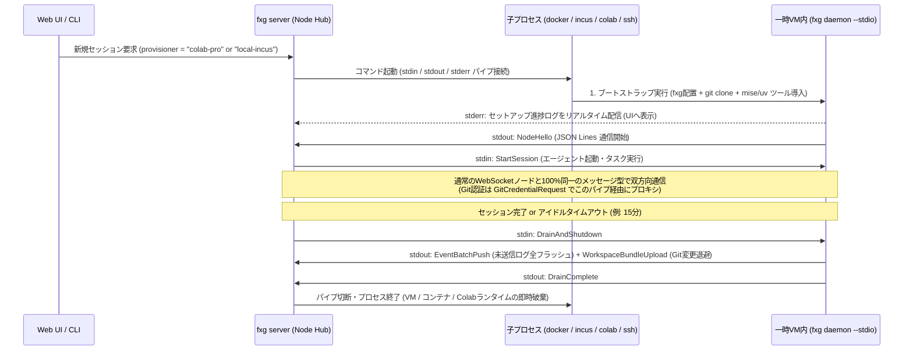

# 01. 全体アーキテクチャ・同期モデル・一時VM・プロジェクト解決

本ドキュメントでは、FlexAgent (`fxg`)
の通信トポロジー、中央サーバー停止時にも機能するローカルファースト同期（Store-and-Forward）、ネットワーク非依存の一時VM・サンドボックスノード（`fxg daemon --stdio`）、および異なるPC・OS間で同じプロジェクトとして認識する仕組みを定義します。

---

## 1. システムトポロジーとコンポーネントの責務



### 各モードの起動方法（単一バイナリ `fxg`）

- **中央サーバー**: 自宅LAN内の常時稼働マシンやミニPC等で
  `fxg server --port 8080`
  を起動（LANまたはプライベートVPN内のみ公開し、パブリック露出は行わない）。
- **常駐ノードデーモン**: 各開発マシン（Windows, Mac, Linux, WSL）で
  `fxg daemon` を常駐（デフォルトで `127.0.0.1:7860`
  のローカルループバックのみバインド）。
- **一時VM / サンドボックスノード**: 中央サーバーが Docker / Incus / Google
  Colab (`google-colab-cli`)
  等のコマンドを子プロセスとしてスポーンし、その標準入出力パイプ上で
  `fxg daemon --stdio --ephemeral` を直結起動（CLI の `--provisioner`
  も中央サーバーの API 経由で要求されるため、中央サーバー必須）。
- **CLI**: 開発者がターミナルで `fxg run <agent>` を実行。

---

## 2. ローカルファースト & Store-and-Forward 同期プロトコル

中央サーバーが単一障害点（SPOF）になることを防ぐため、**すべてのセッション状態とイベントの一次ソース（Primary
Source of Truth）は実行中のノード (`node.db`)** に置きます。中央サーバー
(`server.db`) は全ノードの複製兼ルーティングハブとして機能します。

この構造は「**スキーマ1本・ログ1本・権威1つ**」の3原則で運用します
（スキーマ詳細は [`docs/02-database-schema.md`](./02-database-schema.md)）：

1. **スキーマは1本**: `node.db` と `server.db` は同一DDL・同一テーブル名・単一の
   マイグレーションセットを共有し、違いは「行のスコープ」と「実行ロール」のみ。
   スキーマ対称性は規約ではなく単一定義で保証する。
2. **同期はイベントログ1本**:
   セッションのメタデータ（作成・タイトル・ステータス・モード）も
   `session_events` 上のイベントとして記録し、中央サーバーの `sessions` /
   `permission_requests` はイベントから適用される**投影（projection）** とする。
   `SessionUpsert` のような別系統のメタデータ同期は行わない。
3. **書き込み権威は1つ**: セッション状態を書き換えられるのは**実行ノードのみ**。
   中央サーバーはコマンド転送とイベント追記・投影適用のみを行い、セッション状態を
   クライアント要求に応じて直接書き換えない。

### 2.1 イベントID・順序・カーソルの設計

各セッション内で発生するイベント（メッセージ、思考チャンク、ツール呼び出し、権限要求など）は以下の識別子を持ちます：

- `event_id`: **UUID
  v7**（タイムスタンプ順序付きUUID。重複排除・冪等性保証に使用）
- `session_id`: **UUID v7**（セッション識別子）
- `node_seq`: **セッション単位の単調増加整数
  (`1, 2, 3...`)**。**実行ノードのみが採番**し、欠番は生じない。セッション内の論理順序は常にこの値を正とする。
- `cursor`: `session_events.cursor` (AUTOINCREMENT)
  が持つ**そのDBへの取り込み順の連番**。 クライアント（CLI / Web
  UI）の差分再開カーソルとして使用する。`node.db` を購読していれば `node.db` の
  cursor、`server.db` を購読していれば `server.db` の cursor が基準となる
  （**接続先ストア以外の cursor は意味を持たない**）。
- `created_at`: ノード側のローカル時計（Unix epoch
  ms）で記録。複数ノード横断の並び（承認Inbox等）は NTP
  同期された時計を前提とする。

「送信済み」の管理は行単位フラグではなく、**セッション単位の水位
`sessions.synced_up_to_node_seq`**（ハブが ACK した最大
`node_seq`）で表現します。 `node_seq`
は実行ノードだけが採番する欠番のない連番のため水位による表現が成立し、 Outbox
の抽出は `node_seq > synced_up_to_node_seq` の単純な述語、ACK 時の更新も O(1)
になります。

### 2.2 書き込みと同期のフロー (Outbox パターン)



### 2.3 ストリーミングチャンクの配信と永続化（Compaction）方針

思考過程やメッセージ生成のトークン単位チャンク（`AgentMessage`,
`AgentThought`）を1トークンずつSQLiteへ `INSERT`
するとディスクI/OとDBサイズが増大するため、`fxg daemon`
は「配信」と「永続化」を分離して処理します：

1. **メモリ上のリアルタイム配信（全チャンク）**:
   チャンクが到着した瞬間、メモリ上のブロードキャストチャネルを通じてローカルIPC
   / Local
   WS（CLI・ローカルUI）および中央サーバーWebSocket（`LiveStreamDelta`）へ**リアルタイム（遅延なし）**でそのまま流します。この経路はDBを経由しません。
2. **SQLiteへの永続化（ターン完了時のみ）**:
   ストリーミング途中（`is_complete = false`）の中間状態は永続化しません。**ターン完了時に完成したイベント（`is_complete = true`）のみ**を、`node_seq`
   を1つ消費した単一イベントとしてSQLite (`node.db` / `server.db`)
   へ書き込みます。
   - ユーザーメッセージ (`UserMessage`)、ツール呼び出し
     (`ToolCall`)、権限要求/解決 (`PermissionRequest` /
     `PermissionResolved`)、状態変化 (`StatusChanged`)
     などの離散イベントは発生時に即時永続化します。
   - **トレードオフ**:
     クライアントがターン途中で切断した場合、未完了のメッセージ・思考は履歴に残りません（再接続後の履歴には完成済みイベントのみが表示されます）。`LiveStreamDelta`
     は再接続時にリプレイされません。

### 2.4 メタデータのイベントソーシングと投影（権威の一元化）

セッションのメタデータ（作成情報・タイトル・ステータス・モード/コマンド/設定）は専用の同期チャネルを持たず、
`session_events` 上のイベントとして記録します：

- `SessionCreated`（生成直後、`node_seq = 1`。プロジェクト・パス・エージェント・Fork元などを含む）
- `SessionTitleChanged`（UI/CLI
  からのリネーム。コマンドとして実行ノードに到達してから発行）
- `SessionAgentBound`（ACP セッション確立後の `agent_session_id` 確定）
- `StatusChanged` / `CapabilitiesUpdated`（既存。ハブ側 `sessions.status` /
  モード・コマンド・設定投影の更新源）

中央サーバーは受信イベントを `INSERT OR IGNORE`
で追記すると**同一トランザクション**で `sessions` / `permission_requests`
の投影を更新します（イベント→カラムの対応表は
[`docs/02-database-schema.md` §0.3](./02-database-schema.md)）。投影はイベントログから完全に再構築可能であり、
差分同期の ACK（水位 `synced_up_to_node_seq`）はイベントの ACK
だけで完結します。

**不変条件**: 中央サーバーはクライアント要求に応じてセッション状態（`sessions` /
`permission_requests`）を直接書き換えない。書き込みは常に「実行ノードへのコマンド転送
→ ノードが状態更新とイベント発行」を経由します（例外は `git_bundle_path`
等のハブ固有管理フィールドと、
イベント適用の結果としての投影更新のみ）。これにより「どちらの値が正か」という判定規則が1つになります。

なお、ハブの投影が何らかの理由で失われた場合（DB再構築等）に備え、再接続時の
`NodeHello` は
セッションごとの同期状態（`SessionSyncState { session_id, last_node_seq }`）を報告し、
ハブは欠落・遅延を検出したセッションに対して `ResyncRequest` で `from_node_seq`
以降のイベント再送を要求します。

---

## 3. リモート操作コマンドのルーティング（双方向制御）

Android PWAやWeb UIから「プロンプト送信 (`prompt`)」「権限承認
(`respond_permission`)」「中断 (`cancel`)」を行った場合の経路です：

1. **通常時（中央サーバー経由）**: `Android PWA` ➔ `fxg server` ➔ (Outbound
   WSの逆方向RPC) ➔ `fxg daemon` ➔ `Agent`
2. **ローカル直結時（中央サーバー停止時）**: `PC CLI` または
   `localhost:7860 Web UI` ➔ `fxg daemon` ➔ `Agent`
3. **承認リクエスト (`PermissionRequest`) の競合防止**:
   - エージェントが `session/request_permission` を発行すると、`request_id`
     が生成され `status = 'pending'` となります。
   - スマホ（Android PWA）とPCターミナル（`fxg`
     CLI）の両方に承認プロンプトが表示されます。
   - **どちらか一方でユーザーが「Approve / Reject」を押した瞬間**、`fxg daemon`
     がエージェントへ応答を返すと同時に `PermissionResolved`
     イベントを発行し、もう一方の画面の承認ダイアログを自動的に閉じます。
   - 2番目以降の応答は `request_id` 単位で破棄され、`ALREADY_RESOLVED`
     エラーが返却されます（エージェントへの応答は常に1回のみ）。

### 3.1 同期の鮮度と競合解決（マルチクライアント整合性）

ローカル直結 (`localhost:7860`) と中央サーバー経由 (`:8080`)
の2経路で同一セッションを閲覧・操作しても、**セッション状態の論理的な正解は常にノード
(`node.db`)
が一元管理**するため、データの不整合は発生しません。表示タイムラグと操作競合は以下の原則で扱います：

1. **表示鮮度の原則**:
   - ローカル直結: イベント発生と同時（ミリ秒未満〜数ms）に反映。
   - 中央サーバー経由: ノード→サーバーの同期 + 配信の分だけ遅延する（目安: LAN
     で十数ms、VPN 越しで数十〜数百ms）。この差は許容仕様とし、UI
     は未同期イベント件数（Outbox
     残数）と最終同期時刻を表示して状態を可視化する。
2. **重複排除と順序付け**:
   - クライアントは受信イベントを `event_id` / `(session_id, node_seq)` をキーに
     upsert し、重複配信（`LiveStreamDelta`
     と永続イベント、再接続時のリプレイ）を無害化する。
   - ターン途中の `LiveStreamDelta` は `message_id` / `thought_id`
     でマージ表示し、永続イベント到着時に確定表示へ置き換える。
   - セッション内の表示順は `node_seq`
     を正とし、`cursor`（接続先ストアが採番する取り込み順）は
     最後に受信したバッチ位置の記録（`Subscribe { since_cursor }`
     による差分再開）にのみ使用する。
3. **コマンドの冪等性と競合解決**:
   - 全コマンドは `command_id` を持ち、ノードは直近の `command_id`
     を一定時間保持して重複送信（ダブルタップ・WS再送）を `COMMAND_DUPLICATE`
     として破棄する。
   - エージェント実行中（`running`）の `SendPrompt` は、ノード側で Pending Queue
     に蓄積しターン完了後に順次処理する（UI 上も Pending Queue として表示）。
   - ノードが中央サーバーから切断中のリモートコマンドは到達不能のため、サーバーは即座に
     `NODE_OFFLINE` エラーを返却する（キューイングしない）。
4. **コマンド結果の相関**:
   - `ServerToNodeMsg` の各コマンドに対する `CommandResult` (`command_id` 付き)
     は、要求元クライアントへそのまま返却する（成功/失敗・エラーコード）。

---

## 4. 論理プロジェクト (`Logical Project`) の同一性解決アルゴリズム

Windows (`D:\ghq\github.com\nazo6\flexagent`)、Linux VPS
(`/home/nazo/repos/flexagent`)、WSL (`/home/nazo/src/flexagent`)
など、異なるノード上の異なるパスを同一プロジェクトとして束ねるアルゴリズムです。

### 4.1 プロジェクトキー (`project_key`) 算出手順

ノード上でセッションを起動（またはプロジェクトスキャン）する際、`fxg daemon`
は対象ディレクトリ `cwd` に対して以下の優先順位で `project_key` を決定します：

1. **`.fxg.toml` の明示指定（最優先）**: `cwd` またはGitルートに `.fxg.toml`
   が存在し、`project_key = "..."` が定義されていればそれを使用します。
2. **Git Remote URL の正規化（デフォルト自動解決）**:
   `git rev-parse --show-toplevel`
   でGitルートを特定し、`git config --get remote.origin.url`
   を取得して以下の正規化関数を通します：
   ```rust
   /// 例:
   /// "git@github.com:nazo6/flexagent.git" -> "github.com/nazo6/flexagent"
   /// "https://github.com/nazo6/flexagent.git" -> "github.com/nazo6/flexagent"
   /// "ssh://git@gitlab.example.com:2222/team/app.git" -> "gitlab.example.com/team/app"
   pub fn normalize_git_url(raw_url: &str, subpath_from_root: &str) -> String
   ```
   モノレポ等でGitルートのサブディレクトリで起動された場合は、`github.com/nazo6/flexagent#packages/sub`
   のように相対パス（POSIXスラッシュ正規化）を付与します。
3. **フォールバック（非Gitかつ `.fxg.toml` なし）**:
   `local:<node_id>:<folder_name_hash>`
   としてノード固有プロジェクトを作成します（後からUIや `fxg project link`
   コマンドで他ノードのフォルダとマージ可能）。

### 4.2 スマートフォンからの「パス入力不要」なセッション起動

中央サーバーの `project_node_bindings` テーブルには、各ノードが報告した
`(project_id, node_id, local_path)` の組が記録されています。 これにより、Android
PWAから新規セッションを開始する際は：

1. プロジェクト一覧から **`nazo6/flexagent`** をタップ
2. 実行ノード（例: `Home-Windows` または `Home-WSL` または `Sakura-VPS`）および
   Worktree を選択
3. エージェント（`claude-code`, `antigravity-acp` 等）を選択して開始
   という3ステップだけで、対象ノード上の正しいローカルパス（`D:\ghq\...` や
   `/home/...`）でエージェントが起動します。

---

## 5. Git Worktree の解決とマルチセッション並行作業

近年のAIコーディングエージェントでは、「手元の作業ツリーを汚さずに別タスクを並行実行させる」ために
**Git Worktree**
を活用するパターンが急速に定着しています。FlexAgentはWorktreeを第一級オブジェクト（First-class）としてサポートします。

### 5.1 リポジトリ・Worktree・セッションの階層構造

```text
Logical Project (例: github.com/nazo6/flexagent)
 └── Node (例: Home-Win)
      ├── Main Worktree (D:\ghq\...\flexagent)                                    [branch: main]
      ├── Worktree A    (~/.flexagent/worktrees/github.com-nazo6-flexagent/feat-auth) [branch: feat/auth]  <-- Session #1
      └── Worktree B    (~/.flexagent/worktrees/github.com-nazo6-flexagent/fix-bug)   [branch: fix/bug]    <-- Session #2
```

- 各ノードの `fxg daemon` は `git worktree list --porcelain`
  を定期・起動時に実行し、同一リポジトリに属するすべての
  Worktree（パス、ブランチ、HEADコミット）を自動検出して中央サーバーへ報告します。
- 検出結果に変化（Worktree の追加・削除・ブランチ切替）があった場合、ノードは
  `NodeProjectReport` を含む `NodeHello` を再送し、`server.db` の
  `project_node_bindings` を更新します。
- `fxg` が新規作成する Worktree は、親フォルダを散らかさないようデフォルトで
  `~/.flexagent/worktrees/<project>/<branch>` に集約されます（`config.toml` /
  `.fxg.toml` の `worktree_dir_template` で変更可能）。
- 各セッションは特定の `(node_id, local_path)`（特定の
  Worktree）にバインドされます。これにより、同一マシン上で複数エージェントを走らせても作業ツリーやブランチの競合が発生しません。

### 5.2 Worktree のライフサイクル操作

GUI（Web UI / PWA）やCLIから以下のWorktree操作をシームレスに実行できます：

1. **新規Worktree作成とセッション同時起動**:
   - `fxg run <agent> --worktree feat/new-api`（または
     `fxg worktree add feat/new-api`）や
     GUIの「＋新規Worktreeで開始」から、`git worktree add -b feat/new-api <path> <base_branch>`
     （および `.fxg.toml` の `copy_files` / `post_create`
     フック）を自動実行してそのパスでエージェントを立ち上げます。
2. **作業完了後の後片付け**:
   - マージ後またはセッション完了時に、CLI（`fxg worktree remove`）やGUIからワンクリックで
     Worktree
     ディレクトリを安全にクリーンアップ（`git worktree remove`）できます。

---

## 6. 一時VM・サンドボックスノード (`fxg daemon --stdio` & Zero-Touch Provisioner)

自前サーバー上でホストOSの権限・ファイル（`~/.ssh`
や他プロジェクト）から隔離された環境でエージェントを動かしたい場合や、**Google
Colab Pro**
の潤沢な計算資源・GPUをオンデマンドな実行ノードとしてスポーンしたい場合のため、**一時VM・サンドボックスノード（Ephemeral
Node）** をサポートします。

### 6.1 設計原則：Stdio パイプ直結によるネットワーク・VPN完全非依存

一時VMを立ち上げる際、VM側から中央サーバーへネットワーク経由で折り返し接続（WebSocketコールバック）させようとすると、Tailscale等の特定VPNへのロックインやファイアウォール/NAT越えの複雑な設定が必要になります。

これを根本的に排除するため、一時ノードは **`fxg server`
が子プロセスとしてスポーンしたプロビジョナーコマンドの標準入出力
(`stdin / stdout`) 上で直接 `NodeToServerMsg` / `ServerToNodeMsg` (JSON Lines)
をやり取りする `fxg daemon --stdio` 方式** を採用します。
プロビジョナーコマンドは常に **中央サーバー (`fxg server`)
ホスト上**で起動され、 CLI の `fxg run --provisioner` も中央サーバーの API
経由で要求されます
（中央サーバーが停止している環境では一時VM起動は行えません。ノード単独での一時VM起動は非対応です）。



- **ネットワーク設定・VPNロックインの完全排除**:
  - Docker (`docker run --rm -i`), Incus (`incus exec`), SSH (`ssh`), Google
    Colab (`uvx google-colab-cli ssh/exec`)
    はすべて、起動元プロセスと対象環境の間に最初から `stdin / stdout`
    の双方向パイプを持っています（ColabへはホストからGoogleのAPIへ通常の外向きHTTPSで接続）。
  - そのパイプ上でそのまま通信するため、`fxg`
    はTailscale等のVPNやポート開放を一切意識する必要がありません。
- **完全ステートレス運用（キャッシュ不整合の排除）**:
  - 初期設計では共有キャッシュボリュームやスナップショットによる状態持ち越しを行わず、**「毎回まっさらな環境を立ち上げ、プリビルドの単一バイナリ群を展開して使い捨てる」**
    完全ステートレス方式とすることで、ロック残留や環境汚染を防ぎます。

### 6.2 コマンドテンプレート型プロビジョナー (`~/.flexagent/config.toml`)

`fxg` 本体に特定の仮想化基盤やクラウドのSDKをハードコードせず、`config.toml` に
**「標準入出力で最終的に `fxg daemon --stdio` を起動するコマンド」**
を定義するだけで任意の環境をプロビジョナーとして登録できます。

```toml
# ~/.flexagent/config.toml

# 1. 自前サーバー上の高速コンテナ隔離 (Docker / Rootless Podman)
[provisioners.local-docker]
description = "Local isolated Ubuntu container (Docker)"
command = "docker"
args = ["run", "--rm", "-i", "ubuntu:24.04", "sh", "-c", "{BOOTSTRAP_SCRIPT}"]
idle_timeout_secs = 900

# 2. 自前サーバー上の完全VM / システムコンテナ隔離 (Incus / LXD)
[provisioners.local-incus]
description = "Local KVM MicroVM / LXC (Incus)"
command = "incus"
args = ["launch", "--ephemeral", "images:ubuntu/24.04", "{INSTANCE_NAME}", "--", "sh", "-c", "{BOOTSTRAP_SCRIPT}"]
idle_timeout_secs = 900

# 3. Google Colab Pro オンデマンドGPUノード (google-colab-cli)
[provisioners.colab-pro]
description = "Google Colab Pro (T4 GPU Runtime)"
command = "uvx"
args = ["google-colab-cli", "ssh", "--gpu", "t4", "--command", "{BOOTSTRAP_SCRIPT}"]
idle_timeout_secs = 900
```

### 6.3 Zero-Touch 自動ツールセットアップ (`stderr` ログ分離 + `mise` / `uv`)

手動での環境構築を一切不要にするため、`{BOOTSTRAP_SCRIPT}`
内では以下の手順が全自動で実行されます。この際、**セットアップの出力はすべて
`stderr` (`>&2`) にリダイレクト**し、`stdout` は `fxg daemon --stdio`
のプロトコル通信専用に保護します。

```bash
# 自動生成されるブートストラップ処理の流れ
set -eu
{
  echo "[fxg-bootstrap] Installing fxg & mise..."
  curl -fsSL https://github.com/nazo6/flexagent/releases/latest/download/fxg-linux-x86_64 -o /tmp/fxg
  chmod +x /tmp/fxg
  /tmp/fxg bootstrap-workspace --repo "$FXG_GIT_URL" --branch "$FXG_GIT_BRANCH" --dir /tmp/workspace
} >&2

# セットアップ完了後、stdout/stdin を用いてデーモン通信を開始
exec /tmp/fxg daemon --stdio --ephemeral --workspace /tmp/workspace
```

- **ブートストラップ時の環境変数注入**: プロビジョナー起動時に `fxg server` が
  `FXG_GIT_URL` / `FXG_GIT_BRANCH` および**短命の `FXG_GIT_TOKEN`**
  を環境変数として注入します。 デーモン起動前の
  `git clone`（`bootstrap-workspace` 内）は、`bootstrap-workspace`
  が内部で生成する `GIT_ASKPASS` ヘルパー経由で `FXG_GIT_TOKEN` を Git
  に渡します（URL へのトークン埋め込みは行わない）。 トークンは一時VMの
  Drain・プロセス終了とともに失効します。デーモン起動後（`exec fxg daemon --stdio`
  以降）は §6.4 の `GIT_ASKPASS` プロキシ（stdio パイプ経由の
  `GitCredentialRequest`）に切り替わります。

#### `fxg bootstrap-workspace` が自動で行うこと

1. **スタンドアロンツールマネージャ (`mise` / `uv`) の配置**:
   - 単一バイナリである `mise` と `uv` を `~/.local/bin`
     にプリビルド取得します（root権限・`apt` 不要、数秒で完了）。
2. **リポジトリの構成ファイルからのゼロコンフィグ自動導入**:
   - クローンしたリポジトリのルートを検査し、設定ファイルが存在すれば対応するツールチェインのプリビルドバイナリを
     `mise install --yes` で自動導入します：
     - `Cargo.toml` / `rust-toolchain.toml` ➔ `rust` (`cargo`, `rustc`)
     - `package.json` / `.node-version` ➔ `node`（およびロックファイルに応じて
       `pnpm` / `bun` / `yarn`）
     - `pyproject.toml` / `.python-version` ➔ `uv` による Python
       ランタイム＆仮想環境構築
     - `mise.toml` / `.tool-versions` ➔ 記載された全ツール
     - 標準必須CLI（`git`, `ripgrep`, `fd`, `jq`, `gh`）
3. **`.fxg.toml` によるプロジェクト固有初期化（任意）**:
   - リポジトリに `.fxg.toml` の `[bootstrap]`
     セクションがある場合は、追加指定された `tools`
     と初期化コマンド（`setup = ["cargo fetch", "pnpm install --frozen-lockfile"]`
     等）を自動実行します。

### 6.4 秘密情報をVMに残さない Git Credential Proxy と破棄前の成果物退避

1. **Git Credential Proxy（VM内への秘密鍵・PAT配置ゼロ）**:
   - 一時VMやColabのディスクに個人のSSH秘密鍵や恒久的なGitHub
     PATを保存しません。
   - **ブートストラップ中**（デーモン起動前）: §6.3
     のとおり、プロビジョナー起動時に注入された短命 `FXG_GIT_TOKEN` を
     `bootstrap-workspace` の `GIT_ASKPASS`
     ヘルパー経由で使用します（環境変数はオンメモリで扱い、ディスクには残さない）。
   - **デーモン起動後**: `fxg daemon --stdio` は自分自身を `GIT_ASKPASS`（および
     Git credential helper）として設定します。VM内で `git clone` / `git fetch` /
     `git push` が走ると、すでに繋がっている `stdio` パイプ上で
     `NodeToServerMsg::GitCredentialRequest`
     を中央サーバーへ送り、中央サーバーから対象リポジトリの認証トークンをオンメモリで受け取ってGitへ渡します。
     - **実装**: デーモンはエージェントプロセスへ `GIT_ASKPASS`
       （`~/.flexagent/git-askpass.sh` → `fxg git-askpass <prompt>`）と
       `GIT_TERMINAL_PROMPT=0` を注入する。ヘルパーはローカルIPC でデーモンへ
       問い合わせ、デーモンが Node ⇔ Server 接続（WS / stdio 共通）上で
       `GitCredentialRequest` を中継する。トークンは
       `[server.git_credentials.<host>]`（`provider = "gh_cli" | "env"`）
       からサーバー側で解決する。
2. **破棄前の Graceful Drain と Git Bundle 自動退避（ベストエフォート）**:
   - 一時VM内のイベントは VM 内の `node.db` に蓄積し、終了時に中央サーバーから
     `ServerToNodeMsg::DrainAndShutdown`
     を送信して未送信分を一括フラッシュします。
   - **トレードオフ**: Drain 前にクラッシュ・強制終了した場合、VM
     内に未送信のまま残っていたイベントは失われます（VM
     内ディスクごと消滅するため）。この損失は許容仕様とします。
   - `fxg daemon`
     は未送信のイベントログをすべてフラッシュ（`EventBatchPush`）した上で、ワークスペースの未プッシュコミット・未コミット変更を
     **`git bundle create` で単一バンドルデータに固め、`WorkspaceBundleUpload`
     メッセージとして中央サーバーへ退避**します。
   - **実装順序**: `DrainAndShutdown` 受信 → (1) セッション / PTY 停止
     (`StatusChanged(Stopped)` 記録) → (2) Outbox 全フラッシュ → (3)
     未コミット変更を
     Shadow Git Tree + `git commit-tree`
     でスナップショットコミット化（`refs/heads/fxg-snapshot`）
     した上で `git bundle create --all` → (4) `WorkspaceBundleUpload`
     （8 MiB 単位の Base64 分割転送。サーバーは `DrainComplete`
     までチャンクを蓄積して連結）→ (5) `DrainComplete` 送信 → 子プロセス終了。
     復元は `restore_git_bundle_b64` を `StartSession` に載せ、別ノードが
     `git clone <bundle>` / `git fetch <bundle>` + `checkout -f -B`
     でスナップショットブランチを再現する。
   - **仮セッション投影**: ブートストラップ中（`NodeHello` 前）も UI
     にセッションを
     見せるため、中央サーバーは `sessions` 行を `status = 'provisioning'`
     で先行挿入する（イベントではなく投影行。ノードの `SessionCreated`
     が派生カラムを上書きする。書き込み権威の一元化は維持）。
   - これにより、一時VMが破棄された後でも、中央サーバーのUI上で差分を閲覧したり、別のノード（手元のWindows
     PC等）へ引き継いでセッションを `Fork` / 再開できます。

---

## 7. セキュリティアーキテクチャ（LAN限定運用とブラウザ攻撃対策）

FlexAgentのWeb UIは、エージェントを通じたファイル変更・コマンド実行やWeb
PTY（対話シェル）の操作を可能にするため、実質的に**リモートコード実行（RCE）権限**を持ちます。LAN内での運用であっても、ブラウザを経由したローカル攻撃（CSRF
/ DNS Rebinding / Cross-Site WebSocket
Hijacking）や不正アクセスを防ぐため、以下の多層防御モデルを標準仕様として組み込みます。

### 7.1 ネットワーク境界の原則（最小露出）

- **中央サーバー (`fxg server`)**:
  - 家庭内LAN、社内プライベートLAN、または **Tailscale / WireGuard**
    などのプライベートVPNメッシュ内のみでの接続を前提とします。パブリックインターネットへの直接露出（ルータのポート開放・クラウドのセキュリティグループ全開放等）は行いません。`0.0.0.0`
    バインドはファイアウォール / VPN で隔離されたLAN内に限定して使用します。
- **ノードデーモン (`fxg daemon`)**:
  - ローカルWeb/WSサーバー (`LocalAPI`) は、デフォルトで
    **`127.0.0.1:7860`（ローカルループバックのみ）** に厳格バインドします。
  - 同一LAN内の他端末から直接PCの `:7860`
    を叩くことはできず、すべてのリモート操作は中央サーバー経由で中継されます。

### 7.2 ブラウザ固有の攻撃防止（Localhost保護）

開発者が日常的にPCでWebサイトを閲覧する際、悪意あるWebサイト内のJavaScriptが
`http://localhost:7860` や `ws://localhost:7860`
を叩いてPCを侵害することを完全に防ぎます。

1. **Host ヘッダ検証 (DNS Rebinding 対策)**:
   - リクエストの `Host` ヘッダを検査し、`localhost:7860`, `127.0.0.1:7860`,
     または明示的に設定された中央サーバーホスト名以外は `403 Forbidden`
     で即座に拒否します。
2. **Origin ヘッダ検証 (Cross-Site WebSocket Hijacking 対策)**:
   - WebSocketハンドシェイク（`/api/v1/client/ws`, `/api/v1/pty/ws`）時に
     `Origin` ヘッダを検証し、許可されていない外部ドメイン（例:
     `http://evil.com`）からの接続を一切受け付けません。

### 7.3 認証トークンモデルとCookie注入

1. **暗号論的トークンの自動生成**:
   - 初回起動時（または
     `fxg auth generate-token`）、安全な64文字のランダム文字列（`auth_token`）を生成し、`~/.flexagent/auth_token`
     にパーミッション `0600` で保存します。
2. **Web UI 初回アクセスとCookieの安全な設定**:
   - ローカルCLIから `fxg web` を実行すると、ワンタイムURL
     `http://localhost:7860/?token=<AUTH_TOKEN>` がブラウザで開かれます。
   - サーバーはトークンを検証後、`Set-Cookie: fxg_session=<TOKEN>; HttpOnly; SameSite=Strict; Path=/`
     を発行します。以降のリクエストはCookieまたは
     `Authorization: Bearer <AUTH_TOKEN>`
     ヘッダでのみ受け付け、未認証アクセスはローカルであっても `401 Unauthorized`
     で遮断します。
   - 例外として、接続先種別のみを返す `GET /api/v1/meta` は認証を免除します
     (Host / Origin 検証は適用)。Web UI は接続先種別の判定をこのエンドポイント
     のみで行い（ホスト名等からの推測はしない）、トークン入力ダイアログを
     中央サーバー / ローカルノードで正しく表示します。
3. **Node ⇔ Server 間のペアリング認証（ノード個別トークン）**:
   - 常駐ノードが中央サーバーのWebSocketへ接続する際、`Authorization: Bearer <NODE_TOKEN>`
     で認証します。
   - トークンは**ノードごとに個別発行**します。中央サーバー上で
     `fxg auth node-token issue <node-id>`
     を実行するとトークンが生成・表示され、`server.db` の `nodes` テーブルには
     ハッシュ (`token_hash`) のみを保存します。ノード側は表示されたトークンを
     `~/.flexagent/node_token` （または `config.toml` の
     `node_token`）へ設定します。
   - サーバーは `NodeHello` の `node_id`
     がトークン発行対象ノードと一致することを検証し、なりすましを拒否します。
     漏洩時は `fxg auth node-token revoke <node-id>`
     で個別に失効・再発行できます。
   - 一時ノードは中央サーバー自身が起動した子プロセスの `stdio`
     パイプ直結であるため、ネットワーク越しのトークン露出自体が発生しません。

### 7.4 Web PTY の制限とリモートポリシー

Web PTY（対話シェル起動）は最も権限が強いため、以下の防御ポリシーを提供します：

- **リモートPTY制御設定 (`allow_remote_pty`)**:
  - 設定（`~/.flexagent/config.toml`）により、リモート（中央サーバー経由）からの
    `PtySpawn` を無効化可能（`allow_remote_pty = false`）。
  - この場合、スマホ等のWebUIからは「エージェントへの指示とツールの承認/却下」のみが行え、自由なシェルの直接実行は遮断されます（ローカル端末直結時のみPTY利用可能）。

### 7.5 緊急キルスイッチ（Panic Button）と監査ログ

- **キルスイッチ (Panic Button)**:
  - CLI（`fxg kill-all`）またはWeb
    UIのヘッダーからワンタップで、現在稼働中の全ノード・全セッションのプロセスツリー（Windows
    Job Object / POSIX Process
    Group）および一時VM子プロセス・PTYを即時強制停止します。
- **監査ログ (Audit Log)**:
  - リモートからのプロンプト送信、ツール承認（`PermissionResolved`）、Worktree操作、一時VMプロビジョニング、セッション起動の送信元（IP、クライアント種別、トークンID）をすべてDBへ永続記録します。
  - 中央サーバー経由の操作は `server.db`、ローカル直結（`localhost:7860` /
    CLI）の操作は実行ノードの `node.db` にも記録し、どちらのAPI接続でも
    `/api/v1/audit/logs` から参照できるようにします。
