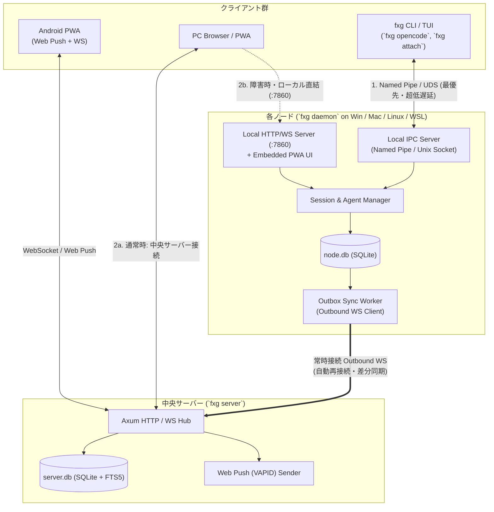
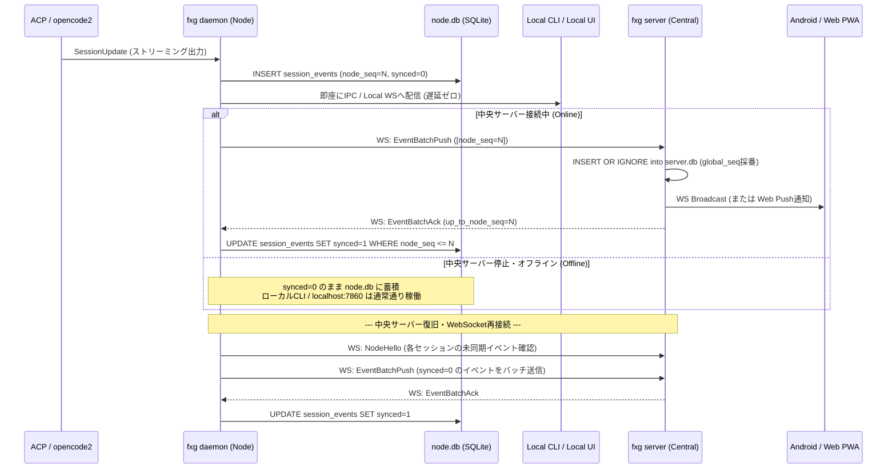

# 01. 全体アーキテクチャ・同期モデル・プロジェクト解決

本ドキュメントでは、FlexAgent (`fxg`)
の通信トポロジー、中央サーバー停止時にも機能するローカルファースト同期（Store-and-Forward）、および異なるPC・OS間で同じプロジェクトとして認識する仕組みを定義します。

---

## 1. システムトポロジーとコンポーネントの責務



### 各モードの起動方法（単一バイナリ `fxg`）

- **中央サーバー**: Linux VPS等で `fxg server --port 8080` を起動。
- **ノードデーモン**: 各開発マシン（Windows, Mac, Linux, WSL）で `fxg daemon`
  を常駐（または `fxg <agent>` 実行時に未起動なら自動スポーン）。
- **CLI**: 開発者がターミナルで `fxg opencode` や `fxg antigravity` を実行。

---

## 2. ローカルファースト & Store-and-Forward 同期プロトコル

中央サーバーが単一障害点（SPOF）になることを防ぐため、**すべてのセッション状態とイベントの一次ソース（Primary
Source of Truth）は実行中のノード (`node.db`)** に置きます。中央サーバー
(`server.db`) は全ノードのレプリカ兼ルーティングハブとして機能します。

### 2.1 イベントIDとシーケンス番号の設計

各セッション内で発生するイベント（メッセージ、思考チャンク、ツール呼び出し、権限要求など）は以下の識別子を持ちます：

- `event_id`: **UUID
  v7**（タイムスタンプ順序付きUUID。重複排除・冪等性保証に使用）
- `session_id`: **UUID v7**（セッション識別子）
- `node_seq`: **セッション単位の単調増加整数 (`1, 2, 3...`)**。ノード側で採番。
- `global_seq`: 中央サーバーの `server.db`
  に取り込まれた際にサーバー側で採番される全体シーケンス番号（クライアントが「前回取得位置からの差分」を購読するために使用）。

### 2.2 書き込みと同期のフロー (Outbox パターン)



### 2.3 ストリーミングチャンクの合体（Compaction）最適化

思考過程やメッセージ生成のトークン単位チャンク（`AgentMessageChunk`,
`AgentThoughtChunk`）を1トークンずつSQLiteへ `INSERT`
するとディスクI/OとDBサイズが増大します。 そのため、`fxg daemon`
は以下のように処理します：

1. **メモリ上のリアルタイム配信**:
   チャンクが到着した瞬間、メモリ上のブロードキャストチャネルを通じてローカルIPC（CLI）および中央サーバーWebSocketへ**リアルタイム（遅延なし）**でそのまま流します。
2. **SQLiteへのフラッシュ**:
   同一メッセージのチャンクはメモリ上で結合し、**「500msごと」または「ターンの区切り（ツール呼び出し・ターン完了時）」**
   にまとめてSQLite (`node.db` / `server.db`) へ永続化します。

---

## 3. リモート操作コマンドのルーティング（双方向制御）

Android PWAやWeb UIから「プロンプト送信 (`prompt`)」「権限承認
(`respond_permission`)」「中断 (`cancel`)」を行った場合の経路です：

1. **通常時（中央サーバー経由）**: `Android PWA` ➔ `fxg server` ➔ (Outbound
   WSの逆方向RPC) ➔ `fxg daemon` ➔ `Agent`
2. **ローカル直結時（中央サーバー停止時）**: `PC CLI` または
   `localhost:7860 Web UI` ➔ `fxg daemon` ➔ `Agent`
3. **承認リクエスト (`PermissionRequest`) の競合防止**:
   - エージェントが `session/request_permission` を発行すると、`request_id`
     が生成され `status = 'pending'` となります。
   - スマホ（Android PWA）とPCターミナル（`fxg`
     CLI）の両方に承認プロンプトが表示されます。
   - **どちらか一方でユーザーが「Approve / Reject」を押した瞬間**、`fxg daemon`
     がエージェントへ応答を返すと同時に `PermissionResolved`
     イベントを発行し、もう一方の画面の承認ダイアログを自動的に閉じます。

---

## 4. 論理プロジェクト (`Logical Project`) の同一性解決アルゴリズム

Windows (`D:\ghq\github.com\nazo6\flexagent`)、Linux VPS
(`/home/nazo/repos/flexagent`)、WSL (`/home/nazo/src/flexagent`)
など、異なるノード上の異なるパスを同一プロジェクトとして束ねるアルゴリズムです。

### 4.1 プロジェクトキー (`project_key`) 算出手順

ノード上でセッションを起動（またはプロジェクトスキャン）する際、`fxg daemon`
は対象ディレクトリ `cwd` に対して以下の優先順位で `project_key` を決定します：

1. **`.fxg.toml` の明示指定（最優先）**: `cwd` またはGitルートに `.fxg.toml`
   が存在し、`project_key = "..."` が定義されていればそれを使用します。
2. **Git Remote URL の正規化（デフォルト自動解決）**:
   `git rev-parse --show-toplevel`
   でGitルートを特定し、`git config --get remote.origin.url`
   を取得して以下の正規化関数を通します：
   ```rust
   /// 例:
   /// "git@github.com:nazo6/flexagent.git" -> "github.com/nazo6/flexagent"
   /// "https://github.com/nazo6/flexagent.git" -> "github.com/nazo6/flexagent"
   /// "ssh://git@gitlab.example.com:2222/team/app.git" -> "gitlab.example.com/team/app"
   pub fn normalize_git_url(raw_url: &str, subpath_from_root: &str) -> String
   ```
   モノレポ等でGitルートのサブディレクトリで起動された場合は、`github.com/nazo6/flexagent#packages/sub`
   のように相対パス（POSIXスラッシュ正規化）を付与します。
3. **フォールバック（非Gitかつ `.fxg.toml` なし）**:
   `local:<node_id>:<folder_name_hash>`
   としてノード固有プロジェクトを作成します（後からUIや `fxg project link`
   コマンドで他ノードのフォルダとマージ可能）。

### 4.2 スマートフォンからの「パス入力不要」なセッション起動

中央サーバーの `project_node_bindings` テーブルには、各ノードが報告した
`(project_id, node_id, local_path)` の組が記録されています。 これにより、Android
PWAから新規セッションを開始する際は：

1. プロジェクト一覧から **`nazo6/flexagent`** をタップ
2. 実行ノード（例: `Home-Windows` または `Home-WSL` または `Sakura-VPS`）および
   Worktree を選択
3. エージェント（`opencode2`, `antigravity-acp` 等）を選択して開始
   という3ステップだけで、対象ノード上の正しいローカルパス（`D:\ghq\...` や
   `/home/...`）でエージェントが起動します。

---

## 5. Git Worktree の解決とマルチセッション並行作業

近年のAIコーディングエージェントでは、「手元の作業ツリーを汚さずに別タスクを並行実行させる」ために
**Git Worktree**
を活用するパターンが急速に定着しています。FlexAgentはWorktreeを第一級オブジェクト（First-class）としてサポートします。

### 5.1 リポジトリ・Worktree・セッションの階層構造

```text
Logical Project (例: github.com/nazo6/flexagent)
 └── Node (例: Home-Win)
      ├── Main Worktree (D:\ghq\...\flexagent) [branch: main]
      ├── Worktree A    (D:\ghq\...\flexagent-feat-auth) [branch: feat/auth]  <-- Session #1
      └── Worktree B    (D:\ghq\...\flexagent-fix-bug)  [branch: fix/bug]    <-- Session #2
```

- 各ノードの `fxg daemon` は `git worktree list --porcelain`
  を定期・起動時に実行し、同一リポジトリに属するすべての
  Worktree（パス、ブランチ、HEADコミット）を自動検出して中央サーバーへ報告します。
- 各セッションは特定の `(node_id, local_path)`（特定の
  Worktree）にバインドされます。これにより、同一マシン上で複数エージェントを走らせても作業ツリーやブランチの競合が発生しません。

### 5.2 Worktree のライフサイクル操作

GUI（Web UI / PWA）やCLIから以下のWorktree操作をシームレスに実行できます：

1. **新規Worktree作成とセッション同時起動**:
   - `fxg session new --worktree feat/new-api` または
     GUIの「＋新規Worktreeで開始」から、`git worktree add -b feat/new-api <path> <base_branch>`
     を自動実行してそのパスでエージェントを立ち上げます。
2. **作業完了後の後片付け**:
   - マージ後またはセッション完了時に、GUIからワンクリックで Worktree
     ディレクトリを安全にクリーンアップ（`git worktree remove`）できます。
