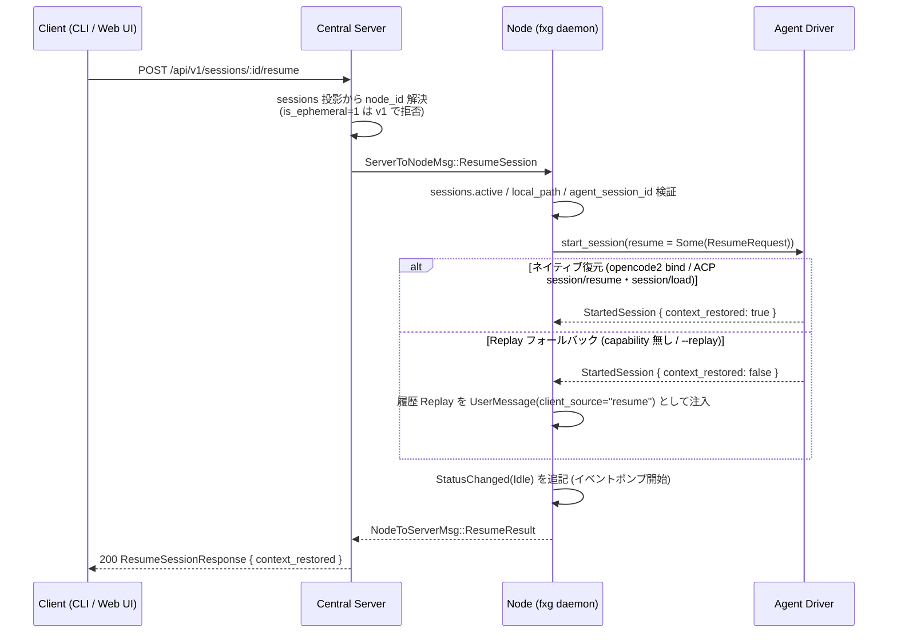

# セッション・レジューム機能 実装案 (Session Resume)

- **日付**: 2026-10-01
- **対象パッケージ**: `fxg-protocol`, `fxg-acp`, `fxg-node`, `fxg-server`,
  `fxg-cli`, `ui`
- **対象スクリプト**: `mise run check` / `mise run check:ui` / `mise run fmt`
- **状態**: ✅ 実装完了 (2026-10-01。検証結果は §14 実装ログ参照)

---

## 0. ゴールとスコープ

停止したセッション (`fxg daemon`
再起動・`fxg session kill`・エージェントプロセス異常終了)
を、**同一 `session_id` のまま**会話コンテキストを維持して再開できるようにする。

| 項目         | 決定                                                                             |
| ------------ | -------------------------------------------------------------------------------- |
| 復元方式     | **ハイブリッド**: ネイティブ復元を優先し、非対応時は履歴 Replay でフォールバック |
| v1 スコープ  | **常駐ノード上のセッションのみ**。一時VM (provisioner) の再開は v2 に延期        |
| 起動経路     | **CLI + REST (ローカル/中央) + Web UI**                                          |
| セッションID | 同一 `session_id` を継続 (`SessionCreated` は再発行しない。イベントは追記継続)   |

## 1. 背景・現状の制約

- `pump_events` はドライバ終了時に `StatusChanged(Stopped)` を追記し、
  `sessions.active` からセッションを除去する
  (`crates/fxg-node/src/session_manager.rs`)。以降 `send_prompt` は
  `InvalidSession` で失敗する。
- 停止済みセッションの再開手段は `fxg session fork` (新規 `session_id` +
  履歴 Replay) のみで、同一セッションの継続はできない。
- エージェント内部セッションIDは `sessions.agent_session_id` に永続化済み
  (`SessionAgentBound` イベントの投影)。**新規カラム・新規イベント型は不要**。
- OpenCode2 は会話履歴をグローバル DB に永続化しており、新しい
  `opencode2 serve` から過去セッションを取得できることを実証済み (docs/04 §3)。
- ACP v1 には `session/load` (履歴 Replay あり) と `session/resume`
  (Replay なし) が定義されている。`agent-client-protocol` 2.2.0 の
  `ConnectionTo::load_session` / `resume_session` ビルダーで利用できる
  (`agentCapabilities.loadSession` / `sessionCapabilities.resume` を要確認)。
  現状の `AcpDriver` は `InitializeResponse` を捨てており、capability
  を見ていない。
- fxg は会話履歴の正本を自前のイベントログ (`node.db`) に持つため、
  履歴をクライアントへ送り返す `session/load` よりも、エージェント内部状態
  だけを復元する `session/resume` を優先する。

## 2. 確定した設計判断

1. **ネイティブ復元の優先順** (履歴の正本は fxg 側にあり、Replay は不要):
   1. `opencode2` (bridge): 既存 opencode セッションへ bind
      (`POST /api/session` をスキップし `agent_session_id` を再利用)。
   2. ACP: `sessionCapabilities.resume` → `session/resume` (履歴 Replay
      なし・優先)。resume 非対応で `loadSession` capability があれば
      `session/load` を使う (Replay 通知は §2.2 で破棄)。
   3. どちらも不可 (または `--replay` 指定) → **Replay フォールバック**
      (fork と同じ履歴注入。`client_source = "resume"`)。
2. **`session/load` 使用時の Replay 通知は破棄する** (resume 非対応
   エージェントのみが通る経路)。load 応答前に届く `session/update` は fxg の
   イベントログと重複するため記録しない (SDK が応答前に受信した通知を
   `ActiveSession` にバッファする仕様を利用し、
   `futures::FutureExt::now_or_never` でキューを drain して捨てる)。
3. **再開の記録は `StatusChanged(Idle)` のみ**。新イベント型は追加しない。
   ネイティブ復元できたかは API 応答 (`context_restored`) でクライアントへ返す。
4. **再開可否は `sessions.active` を正とする**。強制終了 (daemon kill) 時は
   `stopped` への遷移イベントが書かれないため、DB の `status` が
   `idle` / `running` のままでも再開を許可する。
   (`provisioning` / `bootstrapping` は一時VM 専用のため v1 では拒否)。
5. `opencode2` の起動モード (bridge / acp) は `SessionCreated` イベントに
   `opencode_mode` フィールドを追加して永続化する (旧イベントは既定 `bridge`)。
6. 監査ログ action に `session_resume` を追加する。

## 3. 全体シーケンス



ローカル CLI は中央サーバーを介さず、ローカルIPC → `SessionManager::resume`
の同一経路 (ノードは `ClientApiBackend` / IPC の 2 入口を持つ)。

## 4. プロトコル・型の変更 (`fxg-protocol`)

### 4.1 イベント (`src/events.rs`)

```rust
SessionCreated {
    // ...既存フィールド...
    /// OpenCode2 の起動モード ("bridge" / "acp"。opencode2 以外は None)
    #[serde(default)]
    opencode_mode: Option<String>,
}
```

- 後方互換: `#[serde(default)]` により旧 `payload_json` は `None` で読める。
- ts-rs 出力 (`ui/src/lib/generated/UnifiedEventPayload.ts`) は `cargo test`
  で再生成。
- `ensure_session` / `start_session` の両呼び出し元で値を設定する
  (`opencode_mode` の spec 適用ロジックはヘルパーへ共通化: §6)。

### 4.2 ローカルIPC (`src/ipc.rs`)

```rust
// IpcClientMessage に追加
SessionResume {
    command_id: String,
    session_id: String,
    /// ネイティブ復元を試みず Replay で継続する (--replay)
    force_replay: bool,
},

// IpcResult に追加
SessionResumed {
    session_id: String,
    attach_mode: AttachMode,
    /// ネイティブ復元できたか (false = 履歴 Replay で継続)
    context_restored: bool,
},
```

### 4.3 Node ⇔ Central Server (`src/node_server.rs`)

```rust
// ServerToNodeMsg に追加
ResumeSession {
    command_id: String,
    session_id: String,
    force_replay: bool,
},

// NodeToServerMsg に追加 (RevertResult と同型パターン)
ResumeResult {
    command_id: String,
    success: bool,
    code: Option<ErrorCode>,
    context_restored: Option<bool>,
    error: Option<String>,
},
```

### 4.4 REST (`src/client_api.rs`)

```rust
/// `POST /api/v1/sessions/:id/resume` リクエスト。
pub struct ResumeSessionRequest {
    /// ネイティブ復元を試みず履歴 Replay で継続する (既定 false)
    #[serde(default)]
    pub force_replay: bool,
}

/// `POST /api/v1/sessions/:id/resume` レスポンス。
pub struct ResumeSessionResponse {
    pub session_id: String,
    /// ネイティブ復元できたか (false = 履歴 Replay で継続)
    pub context_restored: bool,
}
```

`ClientApiBackend::resume_session` トレイトメソッド +
`client_router` に `/api/v1/sessions/{session_id}/resume` (POST) を追加。

## 5. ドライバ変更 (`fxg-acp`)

### 5.1 `AgentDriver` トレイト (`src/driver.rs`)

```rust
/// 既存エージェントセッションからの再開指定 ([`StartSessionRequest::resume`])。
pub struct ResumeRequest {
    /// 記録済みのエージェント内部セッションID (`SessionAgentBound` の値)。
    /// `None` は新規作成 (Replay フォールバック前提)。
    pub agent_session_id: Option<String>,
    /// ネイティブ復元できない場合に新規セッション作成を許容するか
    pub allow_fresh: bool,
}

// StartSessionRequest に追加
pub resume: Option<ResumeRequest>,

/// `start_session` の戻り値 (ハンドル + ネイティブ復元の成否)。
pub struct StartedSession {
    pub handle: Box<dyn ActiveSessionHandle>,
    /// true = エージェント側コンテキストを復元した
    /// (opencode2 bind / session/resume / session/load)
    pub context_restored: bool,
}

async fn start_session(
    &self,
    req: StartSessionRequest,
    event_tx: mpsc::UnboundedSender<DriverEvent>,
) -> anyhow::Result<StartedSession>;  // ← 戻り値を変更
```

### 5.2 `AcpDriver` (`src/acp.rs`)

- `InitializeResponse.agent_capabilities` を保持する (現状は破棄している)。
- `run_acp_session` に `resume: Option<ResumeRequest>`
  を渡し、セッション取得を分岐 (fxg は履歴の正本を持つため resume 優先):
  1. `agent_session_id: Some(id)` かつ
     `caps.session_capabilities.resume.is_some()` →
     `cx.resume_session(id, cwd)` (履歴 Replay なし) →
     `context_restored = true`
  2. 上記以外で `caps.load_session` → `cx.load_session(id, cwd)`。
     応答後、バッファ済み Replay 通知を `now_or_never`
     ループで破棄 (記録しない) → `context_restored = true`
  3. `id` があるがネイティブ不可:
     - `allow_fresh` → 新規作成 (`context_restored = false`)
     - それ以外 → `anyhow::bail!` (セッションは `error` 状態になる)
  4. `agent_session_id: None` → 新規作成 (`context_restored = false`)
- capability 分岐は純関数 (例: `fn plan_resume(caps, req) -> ResumePlan`)
  に切り出して
  ユニットテスト可能にする。

### 5.3 `OpenCode2Driver` (`src/opencode2.rs`)

- `resume.agent_session_id: Some(id)` の場合:
  - `POST /api/session` をスキップし、`id` へ bind する
    (SSE 購読・capabilities 同期・ハンドル構築は既存フローを共有)。
  - 存在確認: `GET /api/session/{id}` が使えるか実機で確認する。
    使えない場合は事前検証を省略し、初回 prompt の失敗で検知する
    (計画リスク参照)。
    404 時は `allow_fresh` なら新規作成、それ以外はエラー。
  - `SessionAgentBound` の再発行は不要 (同一ID)。
  - `initial_mode` 指定時は bind 後に `POST /api/session/{id}/agent`
    で適用する。
- `opencode2 acp` モード (`driver_kind = "acp"`) は `AcpDriver`
  側のロジックに従う。

### 5.4 テスト用モック (`fxg-node/src/testutil.rs` ほか)

- `MockAgent` / `fxg-acp` のテストモックを `StartedSession` 戻り値へ追従させる。
- `MockAgent` に「ネイティブ復元可否」設定を追加し、`resume` の受信内容
  (`agent_session_id` / `allow_fresh`)
  を記録してテストから検証できるようにする。

## 6. セッションマネージャ (`fxg-node/src/session_manager.rs`)

```rust
/// 停止済みセッションの再開要求 ([`SessionManager::resume`])。
pub struct ResumeParams<'a> {
    pub command_id: &'a str,
    pub session_id: &'a str,
    /// ネイティブ復元を試みず Replay で継続する
    pub force_replay: bool,
}

pub async fn resume(&self, params: ResumeParams<'_>) -> Result<EnsureSessionOutcome, NodeError>
```

処理手順:

1. `begin_command` で冪等排除。
2. `Sessions` に `resuming: HashSet<String>` を追加し、二重レジュームを排他
   (active は勿論、並行 resume 中の ID も拒否)。完了時に除去する。
3. `sessions.active` に存在 → `InvalidState("already active")`。
4. `db.get_session(session_id)` で行取得 (無ければ `InvalidSession`)。
   `status` が `provisioning` / `bootstrapping` → `InvalidState` (一時VM は
   v2)。
5. `local_path` の存在確認 (Worktree 削除済み等は `InvalidState` +
   明示メッセージ)。
6. `SessionCreated` イベントから `opencode_mode` を解決し、起動スペックを構築
   (agent_id は `sessions.agent_id`)。モード適用は
   `ensure_session` / `start_session` と共通ヘルパーへ抽出する (DRY)。
7. `resume` 指定を組み立てて `start_driver_session` を呼ぶ:
   - `force_replay` → `agent_session_id: None`
   - それ以外 → `agent_session_id = sessions.agent_session_id`,
     `allow_fresh: true`
8. 起動成功後 `StatusChanged(Idle)` を追記する。
   (失敗時は既存どおり `StatusChanged(Error)` が記録される)
9. `context_restored == false` の場合、全イベントから Replay コンテキストを
   組み立て `start_turn(session_id, &context, "resume")` で注入する
   (既存 `build_fork_context` / `assemble_fork_context` を
   `build_history_replay_context` にリネームして共用。fork 呼び出し元も更新)。
10. `EnsureSessionOutcome { session_id, attach_mode }` を返す (fork / run
    と共用)。

補足:

- `start_driver_session` の `StartDriverParams` に
  `resume: Option<ResumeRequest>` を
  追加し、戻り値を `(Arc<dyn ActiveSessionHandle>, bool /* context_restored */)`
  に変更する。新規起動 (`ensure_session` / `start_session` / `fork`) は
  `resume: None` を渡し戻り値の bool を無視する。
- Replay 注入は `start_turn` 経由のため busy 管理・スナップショット
  (`snapshot_tree_hash`)・イベント記録が fork と完全に同一の経路になる。
- OpenCode2 再開後はドライバ内 `prompt_ids` (Revert 用) が空になるため、
  `revert_context` が巻き戻しを行わない既知の制約がある (§10 参照)。

### 6.1 エントリポイント

| 入口              | 変更箇所                                                                        |
| ----------------- | ------------------------------------------------------------------------------- |
| ローカルIPC (CLI) | `daemon/ipc.rs` に `SessionResume` ディスパッチ → `IpcResult::SessionResumed`   |
| ローカル REST     | `daemon/api.rs` の `ClientApiBackend::resume_session` → `manager.resume` + 監査 |
| 中央サーバー中継  | `sync.rs` に `ServerToNodeMsg::ResumeSession` → `NodeToServerMsg::ResumeResult` |

監査 action: `fxg-db/src/audit.rs` に
`pub const SESSION_RESUME: &str = "session_resume";` を追加
(UI 監査ページ `ui/src/routes/audit/+page.svelte` の表示名マップにも追加)。

## 7. 中央サーバー (`fxg-server`)

- `src/api/mod.rs`: `ClientApiBackend::resume_session` (既定実装なし) +
  ルーター `/api/v1/sessions/{session_id}/resume` (POST) + ハンドラ。
- `src/state.rs` (`ClientApiBackend for ServerState`):
  1. `session_node()` でノード解決 (オフラインは `NODE_OFFLINE`)。
  2. `nodes.is_ephemeral = 1` のセッションは v1 では `INVALID_STATE`
     (`resume for ephemeral sessions is not supported yet`)。
  3. `hub.resume_session()` で `ServerToNodeMsg::ResumeSession` を相関中継。
  4. 監査 `session_resume` を記録し `ResumeSessionResponse` を返す。
- `src/hub.rs`: `PendingResponse::Resume { context_restored, error }` と
  `pub async fn resume_session(...)` を追加。`NodeToServerMsg::ResumeResult`
  受信時に `resolve()` する。
- 一時VM (`provisioner`) セッションの再開 (bundle 復元 + VM 再起動) は **v2**。
  設計余地: `state.rs` の `prepare_fork` と同様に
  `sessions.git_bundle_path` から `restore_git_bundle_b64` を再構築し、
  `Provisioner` 経由で `StartSession` する経路を将来追加する。

## 8. CLI (`fxg-cli`)

- `src/client.rs`:
  `resume_session(session_id, force_replay) -> (attach_mode, context_restored)`。
- `src/commands.rs`: `fxg session` に `resume` サブコマンドを追加。

```text
fxg session resume <SESSION_ID> [-d/--detach] [--replay]
  -d, --detach   TUI を Attach せずバックグラウンドで再開しセッションIDを出力
      --replay   ネイティブ復元を試みず履歴 Replay で継続する
```

- 既定は再開後に `crate::tui::attach` でアタッチ (`fxg run` と同 UX)。
- `--replay` はエージェント側 load 実装が不調な場合の脱出ハッチ。
- 実行結果に応じて「native 復元」「履歴 Replay で継続」を stderr に表示する。

## 9. Web UI (`ui`)

- `src/lib/api/client.ts`: `resumeSession(sessionId, request)` を追加
  (`revertSession` と同じパターン。`encodeURIComponent` 必須)。
- `src/routes/sessions/[id]/+page.svelte`:
  `status === 'stopped' || status === 'error'` のとき「再開
  (Resume)」ボタンを表示。
  成功トーストに `context_restored` の別を表示
  (false の場合は「履歴 Replay で継続しました」)。状態更新は既存の
  `status_change` イベント購読で自動反映される。
- `src/lib/components/chat/Composer.svelte`:
  停止中は入力欄が無効化されているため、
  「再開して続きを入力」CTA を表示 (詳細ページのボタンと同じ API を呼ぶ)。
- 生成型 (`ResumeSessionRequest.ts` / `ResumeSessionResponse.ts`) は
  `cargo test` (ts-rs) で再生成し、`mise run fmt:ui` / `lint:ui` を通す。
- 監査ページ `/audit` に `session_resume: 'セッション再開'` を追加。

## 10. フェーズ別チェックリスト

### Phase A: `fxg-protocol` 型定義

- [x] `SessionCreated.opencode_mode` 追加 (`#[serde(default)]`) と設定箇所の更新
- [x] `IpcClientMessage::SessionResume` / `IpcResult::SessionResumed`
- [x] `ServerToNodeMsg::ResumeSession` / `NodeToServerMsg::ResumeResult`
- [x] `ResumeSessionRequest` / `ResumeSessionResponse` (REST) + ts-rs export
- [x] serde ラウンドトリップテスト (新メッセージ / 旧 SessionCreated の後方互換)

### Phase B: `fxg-acp` ドライバ

- [x] `ResumeRequest` / `StartedSession` 導入と `start_session` 戻り値変更
- [x] `AcpDriver`: capability 取得 + `session/resume` 優先 /
      `session/load` (Replay 通知破棄) の分岐
- [x] `OpenCode2Driver`: 既存セッション bind (存在確認 API の実機確認含む)
- [x] `MockAgent` / 各テストモックの追従 + capability 分岐のユニットテスト
- [x] 実機テスト (`#[ignore]`): opencode2 で create → shutdown → resume 継続

### Phase C: `fxg-node` セッションマネージャ & ローカル API

- [x] `ResumeParams` / `SessionManager::resume` + `resuming` ガード
- [x] `opencode_mode` 適用ヘルパー共通化 / Replay コンテキスト関数リネーム
- [x] `daemon/ipc.rs` ディスパッチ + IPC テスト
- [x] `daemon/api.rs` REST 実装 + 監査 `session_resume`
- [x] `sync.rs` `ResumeSession` ハンドラ
- [x] session_manager テスト (native / replay / 拒否系 / force_replay)

### Phase D: `fxg-server` 中継

- [x] `ClientApiBackend::resume_session` + ルート + ハンドラ
- [x] `hub.rs` `PendingResponse::Resume` / `resume_session` / resolve
- [x] `state.rs` 実装 (node 解決・is_ephemeral 拒否・監査)
- [x] `sync_e2e` に start → kill → resume → prompt の E2E を追加

### Phase E: CLI / UI / ドキュメント

- [x] `fxg session resume` サブコマンド + `client.rs` メソッド
- [x] `cli_e2e` に resume シナリオ追加
- [x] UI: `client.ts` / 詳細ページ Resume ボタン / Composer CTA / 監査表示名
- [x] `docs/03` §1・§2・§3.1・§4 の追記
- [x] `docs/04` に §4.3「セッションのレジューム」新設
- [x] `docs/05` CLI コマンド表 + UI 操作の追記
- [x] 本ファイルのチェックリストと実装ログを更新

## 11. テスト計画

| 層             | 内容                                                                                                                  |
| -------------- | --------------------------------------------------------------------------------------------------------------------- |
| `fxg-protocol` | 新メッセージの serde、旧 `SessionCreated` (opencode_mode 無し) のデシリアライズ                                       |
| `fxg-acp`      | capability → 復元方式決定のユニットテスト (純関数)。実機 ignore テストで opencode2 bind 継続を検証                    |
| `fxg-node`     | `MockAgent` による resume 経路: native 成功 / Replay フォールバック / active 拒否 / `--replay` 強制 / local_path 消失 |
| `fxg-node`     | daemon IPC のリクエスト・レスポンス round trip                                                                        |
| `fxg-server`   | `sync_e2e` (server + node): セッション停止 → REST resume 中継 → プロンプト継続                                        |
| `fxg-cli`      | `cli_e2e`: `fxg session resume -d` の出力と状態遷移                                                                   |
| `ui`           | Vitest (client.ts の fetch モック) + `svelte-check` / `oxlint`                                                        |
| 手動           | 実 opencode2: `fxg run opencode -d` → `fxg session kill` → `fxg session resume` で文脈維持を確認                      |

## 12. リスク・未解決事項

1. **OpenCode2 の既存セッション操作 API (実機確認済み 2026-10-01 / opencode2
   2.0.18)**:
   `GET /api/session/{id}` は既存セッションに 200、未知IDに 404 を返し、
   bind 前の存在確認に使用する。`GET /api/session/{id}/message` は履歴一覧
   (`{"data":[],"cursor":...}`) を返すため、`prompt_ids` 復元 (リスク 4) の
   将来対応に利用できる。
2. **`session/load` の Replay 通知順序**: ACP 仕様は「応答前に Replay」だが、
   応答後に届く実装だとイベントが重複記録される。drain は応答直後の
   キューに限定し、将来必要ならメッセージIDでの重複排除を追加する。
   `session/resume` 優先のため、この経路を通るのは resume 非対応
   エージェントに限定される。
3. **Replay フォールバックの精度**: fork と同様、会話は要約テキスト1プロンプト
   として注入される (完全なコンテキスト復元ではない)。
4. **OpenCode2 再開後の Revert 精度低下**: `prompt_ids` がメモリ保持のため
   再開後は空になり、`revert_context` が会話を巻き戻さない。
   将来 `GET /api/session/{id}/messages` 等で `prompt_ids` を復元する。
5. **二重 resume レース**: 複数クライアント同時実行を `resuming` ガードで防ぐ。
6. **強制終了後の DB status 不整合**: `sessions.active` を正とする判定 (§2.4) で
   回避するが、UI 上は `running` 表示のまま停止しているセッションに
   Resume ボタンを出す必要がある (status が `stopped`/`error` 以外でも
   エージェント未稼働なら再開可能。UI 側の表示条件も `sessions.active` に
   相当する情報が無いため、v1 は UI からも常に Resume を出し、
   ノード側で拒否する方針とする)。

## 13. 将来拡張 (v2 以降)

- 一時VM (provisioner) セッションの再開
  (`git_bundle_path` 復元 + VM 再起動 + Replay)。
- `fxg daemon` 起動時の自動レジューム (設定 `auto_resume = [...]` 等)。
- セッション一覧/検索からの `resume` 導線、Android PWA の Push 経由再開。
- Replay 注入に添付ファイル (`AttachmentMeta`) を含める完全復元。

## 14. 実装ログ (2026-10-01 完了)

### 実装差分

- **`fxg-protocol`**: `SessionCreated.opencode_mode`、`SessionResume` /
  `ResumeSession` / `ResumeResult`、REST `ResumeSession{Request,Response}`
  (+ ts-rs 生成 `ui/src/lib/generated/ResumeSession*.ts`)
- **`fxg-acp`**: `ResumeRequest` / `StartedSession`、
  `AcpDriver` の capability 分岐 (`plan_resume` / `acquire_session` /
  `discard_replay_updates`)、`OpenCode2Driver` の既存セッション bind
  (`opencode_session_exists` / `create_opencode_session` 分離)
- **`fxg-node`**: `SessionManager::resume` (+ `resuming` ガード) /
  `apply_opencode_mode` ヘルパー / `build_history_replay_context`
  (`ReplayPurpose`) / IPC・ローカル REST・`sync.rs` の配線 / 監査
  `session_resume`
- **`fxg-server`**: `ClientApiBackend::resume_session` + ルート +
  `hub::resume_session` 中継 (is_ephemeral セッションは v1 拒否)
- **`fxg-cli`**: `fxg session resume <id> [-d|--replay]` + `client.rs`
- **`ui`**: `client.ts` / セッション詳細の Resume ボタン / Composer の再開 CTA /
  監査表示名

### 検証

- `cargo test -p fxg-node resume`: session_manager 4 件 + IPC 1 件 (全て成功)
- `cargo test -p fxg-node --test sync_e2e central_server_resumes_stopped_session`:
  停止 → 中央サーバー REST resume → 継続プロンプト (成功)
- `cargo test -p fxg-cli --test cli_e2e phase3_...`: 未知セッション resume の
  INVALID_STATE、起動失敗エージェントの resume エラーを検証 (成功)
- `mise run test:ui` (44 件) / `mise run lint:ui` (svelte-check 0 errors)
- `cargo test -p fxg-protocol` (132 件。ts-rs 型出力を含む)
- 実機 opencode2 2.0.18 で `GET /api/session/{id}` (200/404) を確認。
  `#[ignore]` の `resumes_existing_session_against_real_opencode2` を追加
  (`FXG_TEST_OPENCODE2=1 cargo test -p fxg-acp -- --ignored` で実行)

### 実装時の設計調整

- `resume` の戻り値は `EnsureSessionOutcome` を流用せず `ResumeOutcome`
  (`context_restored` 付き) を新設した。
- `apply_opencode_mode` への集約により、`ensure_session` の `--acp` 分岐が
  パススルー引数 (`extra_args`) を落としていた既存バグも同時に修正された。
- 強制終了時は `stopped` イベントが書かれないため、再開可否は
  `sessions.active` を正とする (§2.4)。UI は active 情報を持たないため
  Resume ボタンを常時表示し、実行中の場合はノード側の `INVALID_STATE` を
  トースト表示する。
